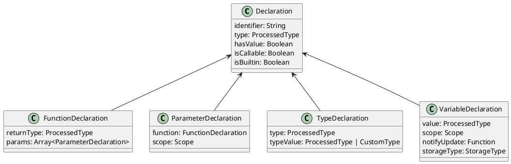
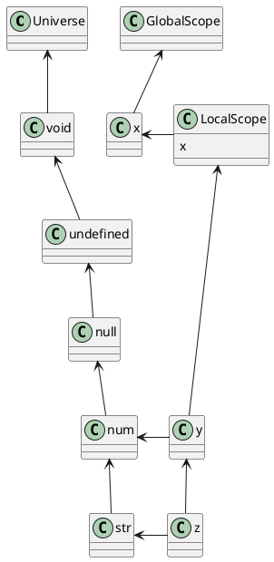

# Bauer Kipper Bericht

## Allgemeines
Mithilfe des erstklassigen fachlichen Wissens von Prof. Dr. Mössenböck machen wir große Fortschritte in unserem Projekt. Bei seinen täglichen Meetings und Vorträgen zum internen Aufbau eines Kompilers konnten wir unter anderem unsere Symboltabelle massiv verbessern. Die Einführung eines Universums half uns, sich das Scopekonzept besser vorstellen zu können.

## Unsere neuen Features bis jetzt

### Luna Klatzer

### Lorenz Holzbauer
Es wurde zuerst String Multiplication implementiert. Dies diente zum Einarbeiten in den Compiler. Nun kann mithilfe des * Operators ein String n-mal wiederholt werden. 

Des Weiteren wurden die Bitwise Operationen implementiert. Bei diesen musste die Order of Precedence richtig eingehalten werden, wofür ein paar Parser-Kniffe nötig waren. 

Außerdem wurde Lambda-Milestone fertiggestellt. Kipper kann nun einer Variable eine Lambda Expression assignen. Diese hat eine seperate Scope und wird Typüberprüft. Aktuell kann man Lambdas leider noch nicht ausführen, da Generics, die Luna implementiert hat, gerade noch nicht gemerged sind. Dennoch können die generierten Lambda Expressions in der Target Language bereits aufgerufen werden.

### Fabian Baitura

## Next Steps

### Luna Klatzer

### Lorenz Holzbauer
Sobald das neue Typsystem gemerged ist, wird die Typrepresentation im Kompilierten Code implementiert. Mithilfe dieser, sollte der typeof-Operator keinen String mehr zurückgeben, sondern ein Runtime-Objekt an dem auf Typgleichheit geprüft werden kann. Aufgrund der Komplexität dieser Aufgabe ist dies der Hauptteil von Lorenz's Forschungsfrage.

Des weiteren wird das Try-Catch Statement implementiert werden, sobald der Exception Type fertiggestellt ist. Die nötige Vorarbeit zur Implementation im Parser und Lexer wurde schon erledigt, es fehlt also noch die korrekte interne Handhabung der Fehler.

### Fabian Baitura

## Deep Dive in unser Typsystem
Der Kern unsere Typsystems ist die Symbolliste. Diese wird mithilfe einer Map implementiert, und enthält Objekte mit folgenden Properties:

Wir haben uns für Vererbung entschieden, um die gemeinsamen Properties von Declaration zu abstrahieren. Wenn zwei Typen miteinander verglichen werden, wird in der Symboltabelle nachgeschaut, die Typen auf den selben Node zeigen. Dies wird rekursiv durchgeführt. Wir verwenden also Duck Typing, um Typen zu vergleichen. Dies ist notwendig, um eine die Kompabilität mit JavaScript zu gewährleisten.

Dies ist der Aufbau unserer Symboltabelle. Die Typen sind in einem Universum, welches die globalen Typen enthält. Jeder Scope hat eine Referenz auf das Universum, und kann auf die globalen Typen zugreifen. Der Scope hat auch eine Referenz auf den Parent Scope, um auf die globalen Typen zuzugreifen. Alle weiteren Scopes erben von LocalScope, wie z.B. FunctionScope oder BlockScope.